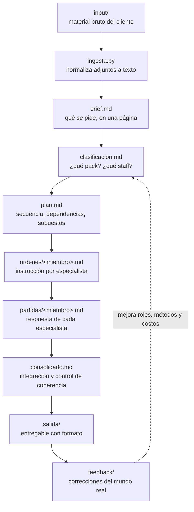

# sistema-agentico-turubro

> Un repositorio que funciona como **el sistema operativo de una oficina de servicios profesionales**.
> Aquí no vive código de una aplicación: vive el conocimiento de un negocio —su gente, sus servicios,
> sus métodos, sus costos y su normativa— escrito en archivos de texto para que un agente
> (Claude Code) pueda **entender un encargo, planificarlo, repartirlo entre especialistas,
> ejecutarlo y entregarlo** con la misma lógica con que lo haría el equipo real.

---

## 1. Objetivo

El objetivo del repositorio es **convertir la forma de trabajar de una oficina en un sistema
reproducible y operable por agentes**, de modo que:

1. **Un encargo desordenado se vuelva trabajo estructurado.** Entra lo que llega en la vida real
   (un correo, fotos, un plano, un audio de reunión, un Excel) y sale un plan, un reparto de
   trabajo, un consolidado y un entregable con formato.
2. **El criterio quede escrito, no en la cabeza de alguien.** Cada especialista tiene su rol, su
   metodología y sus costos en archivos versionados. El agente no improvisa el criterio: lo lee.
3. **El sistema sea auditable.** Cada corrida deja rastro: qué se entendió, cómo se clasificó, qué
   se ordenó a cada especialista, qué respondió cada uno y cómo se consolidó.
4. **El sistema aprenda.** Las correcciones del mundo real vuelven a `feedback/` y desde ahí se
   incorporan a los roles, metodologías y costos. La segunda corrida es mejor que la primera.
5. **La misma estructura sirva para cualquier rubro.** El esqueleto es agnóstico: cambian los
   especialistas, los servicios y la normativa, no la mecánica. En este repo hay dos
   instanciaciones de ejemplo: una **oficina de construcción** y una **agencia de marketing &
   estrategia**.

**Lo que este repo NO es:** no es un chatbot, no es una plantilla de documentos y no reemplaza el
juicio profesional. Es una oficina descrita en texto, con un agente que la opera y una persona que
la dirige y firma.

---

## 2. Los cuatro conceptos que hay que entender

Todo el sistema se apoya en cuatro piezas. Si estas cuatro están bien escritas, el resto funciona.

| Concepto | Carpeta | Qué es | Analogía |
|---|---|---|---|
| **Staff** | `staff/` | Los especialistas que **ejecutan**. Cada uno con su rol, su método y sus costos. | Tu equipo. |
| **Packs** | `packs/` | Los **servicios que la oficina ofrece**. Definen alcance, qué incluye, qué no, y qué staff se activa. | Tu carta de servicios. |
| **Refs** | `refs/` | La **fuente de verdad transversal**: normativa, estándares, tarifarios, manuales de marca. | La biblioteca técnica. |
| **Corridas** | `runs/` | Cada **encargo concreto** ejecutado, con todo su rastro. | El expediente del trabajo. |

El `registry.yaml` es el puente: traduce las señales de un encargo ("soldadura", "galpón",
"reposicionamiento") en **qué pack aplica** y **qué miembros del staff hay que activar**.

---

## 3. Cómo funciona: el ciclo de una corrida



En palabras: **se entiende → se clasifica → se planifica → se reparte → se ejecuta → se consolida
→ se entrega → se aprende.**

Ese ciclo se invoca de tres formas según lo que se necesite:

| Skill | Se usa cuando | Produce |
|---|---|---|
| `proponer` | Todavía hay que **cotizar o convencer**. | `propuestas/<fecha>-<corrida>/propuesta.pdf` |
| `ejecutar` | El trabajo está **aprobado** y hay que hacerlo. | `runs/<id-corrida>/` completo |
| `entregar` | La ejecución está lista y hay que **darle forma de entregable**. | `runs/<id-corrida>/salida/` |

---

## 4. Estructura del repositorio y propósito de cada pieza

Los nombres con prefijo `_` son **marcadores de posición**: no son piezas reales del negocio,
sino la forma que tendrán. Se renombran o se completan al instanciar el repo. En nombres de
archivo se evitan los `< >` —son caracteres ilegales en Windows y rompen el clone—; en el texto
de la documentación sí se usan, como notación.

```text
sistema-agentico-turubro/
│
├── README.md                  Este documento: propósito, estructura y cómo se usa.
├── CLAUDE.md                  Las reglas de operación del agente en este repo: tono, límites,
│                              qué puede decidir solo y qué debe preguntar, formato de salida.
│                              Es la "inducción" que el agente lee siempre.
├── PERSONALIZAR.md            Guía paso a paso para adaptar el repo a un negocio propio:
│                              qué archivos tocar, en qué orden y con qué preguntas.
├── .gitignore                 Qué no se versiona (material de clientes, salidas, temporales).
│
├── .claude/                   El cerebro operativo. Configuración del agente.
│   ├── settings.json          Configuración compartida del proyecto (permisos, hooks, modelo).
│   ├── settings.local.json    Configuración personal de cada usuario. No se comparte.
│   ├── agents/                Los roles del agente. Cada archivo define una mente con un trabajo.
│   │   ├── coordinador.md     Orquesta la corrida de principio a fin. Es el único que habla con
│   │   │                      la persona. Decide cuándo delegar y cuándo preguntar.
│   │   ├── planificador.md    Lee el brief, clasifica contra el registry y arma el plan y el
│   │   │                      reparto de trabajo. No ejecuta.
│   │   └── especialista.md    Plantilla del ejecutor: se instancia una vez por miembro del staff,
│   │                          cargando su rol, su metodología y sus costos. No ve el encargo
│   │                          completo, solo su orden de trabajo.
│   ├── skills/                Los procedimientos. Cada skill es un flujo con pasos y contratos.
│   │   ├── proponer/SKILL.md  Cómo pasar de un encargo a una propuesta comercial.
│   │   ├── ejecutar/SKILL.md  Cómo pasar de un encargo aprobado a trabajo hecho y consolidado.
│   │   └── entregar/SKILL.md  Cómo pasar de un consolidado a un entregable presentable.
│   └── scripts/               Trabajo determinista, que no conviene dejar al criterio del agente.
│       ├── ingesta.py         Toma lo que hay en input/ (PDF, imágenes, audio, Office) y lo
│       │                      normaliza a texto trazable dentro de la corrida.
│       └── resolver.py        Resuelve el registry: dado un conjunto de señales, devuelve qué
│                              packs y qué miembros de staff corresponden.
│
├── staff/                     QUIÉN EJECUTA. Un directorio por especialista.
│   ├── _PLANTILLA/            Molde para crear un miembro nuevo. No se usa en corridas.
│   │   ├── rol.md             Identidad y alcance: qué es, de qué responde, qué NO hace, con qué
│   │   │                      criterio decide, qué necesita recibir para poder trabajar.
│   │   ├── metodologia.md     Cómo trabaja: pasos, orden, controles de calidad, criterios de
│   │   │                      aceptación, errores típicos a evitar, formato de su respuesta.
│   │   ├── costos.md          Cómo cuantifica: unidades, rendimientos, tarifas, factores,
│   │   │                      supuestos de cálculo y qué queda fuera del precio.
│   │   └── referencias/       Material propio del especialista: fichas técnicas, ejemplos,
│   │                          catálogos que solo él necesita.
│   ├── _miembro-1/            Un especialista real de la oficina.
│   ├── _miembro-2/            Otro especialista.
│   └── _miembro-compartido/   Especialista transversal que participa en casi toda corrida
│                              (por ejemplo control de calidad, presupuesto o edición).
│
├── packs/                     QUÉ SE OFRECE. Un directorio por servicio o paquete vendible.
│   ├── registry.yaml          El índice del sistema. Para cada pack declara: nombre, señales que
│   │                          lo activan (palabras, tipos de encargo), staff que participa,
│   │                          referencias obligatorias y formato de entregable.
│   │                          Es el archivo que el agente consulta para clasificar.
│   ├── _PLANTILLA/detalles.md Molde para crear un pack nuevo.
│   ├── _pack-1/detalles.md    Alcance del servicio, qué incluye y qué no, entradas mínimas
│   │                          exigibles al cliente, entregables, plazos típicos, riesgos y
│   │                          supuestos comerciales.
│   └── _pack-2/detalles.md    Otro servicio.
│
├── refs/                      LA FUENTE DE VERDAD transversal, común a todos los especialistas.
│   ├── INDEX.md               Índice curado: qué norma o documento rige qué tema, versión vigente
│   │                          y una línea de resumen. El agente entra por aquí, no por los PDF.
│   ├── _norma.md              Extracto operativo de una norma o estándar: lo que se aplica en el
│   │                          día a día, con cita a la fuente original.
│   └── originales/            Los documentos fuente tal cual (PDF, DOCX). Se citan, no se editan.
│
├── input/                     BANDEJA DE ENTRADA. Aquí se deja el material crudo del encargo:
│   └── .gitkeep               correos, fotos, planos, audios, planillas. Es una zona de paso;
│                              el contenido no se versiona y se archiva dentro de la corrida.
│
├── runs/                      EL EXPEDIENTE de cada encargo ejecutado.
│   └── _id-corrida/           Nombre sugerido: AAAA-MM-DD-<slug-del-encargo>.
│       ├── brief.md           Qué se pide, en una página: cliente, objetivo, alcance, plazo,
│       │                      restricciones, supuestos y lo que quedó pendiente de confirmar.
│       ├── clasificacion.md   Qué pack aplica, con qué evidencia, qué staff se activa y por qué;
│       │                      además lo que se descartó y la razón.
│       ├── plan.md            Secuencia de trabajo, dependencias, riesgos y criterio de cierre.
│       ├── ordenes/           Lo que se le pide a cada especialista.
│       │   └── _miembro.md    Orden de trabajo: contexto mínimo, entregable esperado, límites.
│       ├── partidas/          Lo que cada especialista entregó.
│       │   └── _miembro.md    Su respuesta: desarrollo, cuantificación, supuestos y alertas.
│       ├── consolidado.md     Integración de todas las partidas: coherencia entre especialistas,
│       │                      totales, contradicciones resueltas y decisiones tomadas.
│       ├── adjuntos/          El material del encargo, archivado junto a la corrida.
│       │   ├── _AAAA-MM-DD-lote/     Cada lote recibido, con su fecha, sin modificar.
│       │   └── _texto/        Versión en texto de esos adjuntos, generada por ingesta.py.
│       └── salida/            El entregable final tal como se envía al cliente.
│
├── propuestas/                LO QUE SE OFRECIÓ, antes de ejecutar.
│   └── _AAAA-MM-DD-corrida/
│       ├── brief.md           El encargo entendido en etapa comercial.
│       └── propuesta.pdf      La propuesta enviada. Queda como versión firmada en el tiempo.
│
├── plantillas/                LA FORMA de los documentos: identidad visual y estructura.
│   ├── propuesta.potx         Plantilla de presentación para propuestas comerciales.
│   ├── entregable.potx        Plantilla de presentación para entregables técnicos.
│   ├── estructura-propuesta.md  Guion obligatorio de una propuesta: secciones, orden y qué va en
│   │                            cada una. El agente lo respeta al construir el documento.
│   └── estructura-entregable.md Guion obligatorio de un entregable.
│
├── feedback/                  CÓMO APRENDE EL SISTEMA.
│   ├── GLOBAL.md              Aprendizajes que aplican a todo: sesgos detectados, errores
│   │                          recurrentes, reglas nuevas de la casa.
│   ├── staff/_miembro.md      Correcciones a un especialista: dónde se equivoca, qué le falta,
│   │                          qué criterio debe cambiar. Alimenta su rol y su metodología.
│   ├── packs/_pack.md         Correcciones a un servicio: alcance mal definido, precios fuera de
│   │                          mercado, entregable que no convence.
│   └── _bruto/                Comentarios sin procesar (notas, audios, capturas de un WhatsApp)
│                              a la espera de ser destilados en los archivos de arriba.
│
├── docs/
│   └── ARQUITECTURA.md        El detalle técnico: contratos entre agentes, formato de cada
│                              archivo, esquema del registry, decisiones de diseño y sus razones.
│
└── ejemplos/                  DOS INSTANCIACIONES DE REFERENCIA, para copiar y adaptar.
    ├── construccion/          Oficina de construcción.
    └── agencia-marketing/     Agencia de marketing & estrategia.
```

### Convención de los ejemplos

Dentro de `ejemplos/` la jerarquía viene **aplanada con prefijo** para que se vea de un golpe a
qué carpeta del repo pertenece cada archivo:

| En el ejemplo | Se copia a |
|---|---|
| `ejemplos/<rubro>/staff-soldador/` | `staff/soldador/` |
| `ejemplos/<rubro>/packs-ingeniero-de-obra/` | `packs/ingeniero-de-obra/` |
| `ejemplos/<rubro>/registry.yaml` | `packs/registry.yaml` |

---

## 5. Ejemplo A — Oficina de construcción

Una oficina que hace obras menores, reforzamientos e intervenciones industriales. Vende horas de
especialista y partidas de obra; su fuente de verdad es la normativa técnica y su tarifario.

### Estructura instanciada

```text
ejemplos/construccion/
├── registry.yaml                       → packs/registry.yaml
│     Señales como "soldadura", "estructura metálica", "galpón", "reforzamiento" activan el pack
│     ingeniero-de-obra y convocan al soldador. Declara qué normas de refs/ son obligatorias.
│
├── packs-ingeniero-de-obra/            → packs/ingeniero-de-obra/
│   └── detalles.md
│         El servicio: supervisión e ingeniería de obra. Incluye visita, levantamiento, especifi-
│         cación técnica, cubicación y control de ejecución. No incluye permisos municipales ni
│         proyecto de cálculo estructural firmado. Entrada mínima exigible: planos as-built o
│         levantamiento en sitio. Entregable: informe técnico + cubicación + programa.
│
└── staff-soldador/                     → staff/soldador/
    ├── rol.md
    │     Responde por uniones soldadas: procedimiento, material de aporte, preparación de junta,
    │     inspección visual. NO define geometría estructural ni valida cálculo: eso lo escala al
    │     ingeniero de obra. Necesita recibir espesores, calidad de acero y condición de terreno.
    ├── metodologia.md
    │     Cómo trabaja: verificar norma aplicable → definir procedimiento (WPS) → estimar metros
    │     lineales y posiciones → declarar controles de inspección → listar riesgos de faena.
    │     Criterio de aceptación y errores típicos (soldar en altura sin considerar el andamio).
    ├── costos.md
    │     Unidad: metro lineal por espesor y posición. Rendimiento por jornada, valor hora
    │     hombre, consumo de electrodo, factor por trabajo en altura y por turno nocturno.
    └── referencias/
          Fichas de electrodos y tablas de rendimiento propias del especialista.
```

Los archivos de `staff/` se llenan una vez y sirven para todas las obras. Cada obra nueva solo
genera una carpeta en `runs/`.

### Prompt de ejemplo — oficina de construcción

```text
Encargo nuevo: reforzamiento estructural de galpón — Planta Lo Espejo.

Cliente: Agrícola San Marcos. Contacto: Patricia Ruiz, jefa de mantención.
En input/ dejé el correo del requerimiento, el plano as-built en PDF y 6 fotos del galpón.
Fecha de entrega comprometida: viernes 12 de septiembre.

Trabajo que necesito, en este orden:

1. Ingesta y brief. Procesa lo que hay en input/ y abre la corrida en
   runs/2026-09-05-galpon-lo-espejo. Déjame el brief.md con alcance, plazo, restricciones y —
   explícitamente — lo que no quedó claro del material recibido.

2. Clasificación. Clasifica contra packs/registry.yaml: qué pack aplica, con qué evidencia, qué
   miembros de staff/ se activan y qué normas de refs/ son obligatorias en este caso.
   Si falta un dato que cambia el resultado, pregúntame ANTES de planificar. No lo supongas.

3. Plan y ejecución. Arma el plan, emite la orden de trabajo de cada especialista y ejecútalas.
   Cada partida debe declarar sus supuestos de cálculo: quiero poder discutir el supuesto, no
   solo el número.

4. Consolidado. Integra las partidas, resuelve contradicciones entre especialistas y déjame el
   entregable en runs/2026-09-05-galpon-lo-espejo/salida/ siguiendo
   plantillas/estructura-entregable.md.

Restricciones del encargo:
- La planta no se detiene: la faena se ejecuta en turno de noche. Que eso se refleje en costos.
- Normativa de soldadura vigente según refs/INDEX.md. Cita la norma en cada especificación.
- Tope de presupuesto: 8.000.000 CLP. Si una partida excede el tope, márcala como alternativa
  fuera del total, no la elimines.

Al final, dime en tres líneas qué decisiones tomaste por tu cuenta y cuáles debo revisar yo.
```

---

## 6. Ejemplo B — Agencia de marketing & estrategia

Una agencia que vende procesos de estrategia y marca. Vende pensamiento y ejecución creativa; su
fuente de verdad son los datos del cliente, la investigación y sus propios marcos metodológicos.

### Estructura instanciada

```text
ejemplos/agencia-marketing/
├── registry.yaml                       → packs/registry.yaml
│     Señales como "reposicionamiento", "identidad", "no nos diferenciamos", "lanzamiento de
│     marca" activan el pack estrategia-marca y convocan al estratega. Declara qué referencias
│     de marca y qué fuentes de datos son obligatorias.
│
├── packs-estrategia-marca/             → packs/estrategia-marca/
│   └── detalles.md
│         El servicio: diagnóstico y plataforma de marca. Incluye análisis de categoría y
│         competencia, entrevistas, territorio y propuesta de valor, arquitectura de mensajes y
│         hoja de ruta. No incluye producción audiovisual ni pauta. Entrada mínima exigible:
│         acceso a métricas y al menos dos entrevistas con el cliente. Entregable: plataforma de
│         marca + guion de mensajes + plan de activación a 90 días.
│
└── staff-estratega/                    → staff/estratega/
    ├── rol.md
    │     Responde por el diagnóstico y la decisión estratégica: dónde compite la marca, contra
    │     quién, con qué promesa y con qué renuncia. NO produce piezas ni copy final: eso pasa al
    │     equipo creativo. Necesita recibir datos de negocio, no solo percepciones.
    ├── metodologia.md
    │     Cómo trabaja: leer el negocio antes que la marca → mapear categoría y tensiones →
    │     formular hipótesis de posicionamiento → contrastarlas con evidencia → elegir una y
    │     declarar qué se sacrifica. Criterio de aceptación: si la promesa la puede firmar
    │     cualquier competidor, no sirve. Error típico: confundir tono con estrategia.
    └── costos.md
          Unidad: fase y jornada de estratega. Valor por fase de diagnóstico, entrevista,
          taller de definición y acompañamiento. Qué queda fuera: research cuantitativo con
          proveedor externo, producción, medios.
```

### Prompt de ejemplo — agencia de marketing & estrategia

```text
Encargo nuevo: reposicionamiento de marca — Clínica Dental Andes.

Cliente: Clínica Dental Andes (3 sucursales, Santiago). Contacto: Rodrigo Vera, gerente comercial.
El problema, en sus palabras: "nos comparan solo por precio y estamos perdiendo pacientes nuevos".
En input/ dejé el brief del cliente en Word, el export de métricas de Meta Ads y Google Ads de los
últimos 12 meses en CSV, y los 2 audios de la reunión de kickoff.
Presentación al comité del cliente: jueves 18 de septiembre.

Trabajo que necesito, en este orden:

1. Ingesta y brief. Procesa input/ —incluidos los audios— y abre la corrida en
   runs/2026-09-05-dental-andes-reposicionamiento. En el brief.md separa con claridad lo que el
   cliente afirma de lo que los datos muestran. Si se contradicen, dilo.

2. Clasificación. Clasifica contra packs/registry.yaml: qué pack aplica, qué staff se activa y qué
   entradas mínimas del pack NO están cubiertas con el material que entregué. Eso último es
   prioritario: necesito saber qué pedirle al cliente esta semana.

3. Plan y ejecución. Emite las órdenes de trabajo y ejecuta. Del estratega quiero al menos tres
   hipótesis de posicionamiento contrastadas con evidencia, y una recomendada con su renuncia
   explícita: qué dejamos de ser si tomamos ese camino.

4. Consolidado y entregable. Consolida y arma la presentación en
   runs/2026-09-05-dental-andes-reposicionamiento/salida/ usando plantillas/entregable.potx y el
   guion de plantillas/estructura-entregable.md.

Restricciones del encargo:
- No competimos por precio. Cualquier recomendación que dependa de bajar aranceles queda fuera.
- Toda afirmación sobre la categoría va con fuente. Si no hay dato, se marca como supuesto.
- El comité del cliente son cinco personas no técnicas: lenguaje de negocio, no de agencia.

Al final, dime en tres líneas qué decisiones tomaste por tu cuenta y cuáles debo revisar yo.
```

---

## 7. Qué tienen en común los dos prompts

No es casualidad que los dos se parezcan. Un buen encargo para este sistema trae **siete cosas**:

1. **Qué es** el encargo, en una línea, y **para quién**.
2. **Dónde está el material** y qué es cada archivo.
3. **La fecha** que manda.
4. **Los pasos esperados**, en orden, nombrando las carpetas donde debe quedar el resultado.
5. **Las restricciones reales** del negocio (presupuesto, normativa, operación, política comercial).
6. **La instrucción de preguntar** en vez de suponer cuando falte un dato que cambia el resultado.
7. **La petición de rendir cuentas**: qué decidió el agente solo y qué debe revisar la persona.

Si el prompt trae esas siete cosas, el sistema opera. Si falta la 5 o la 6, el agente inventa
supuestos y el trabajo se pierde.

---

## 8. Cómo darle identidad a este repo

El esqueleto es genérico a propósito. La identidad se construye en este orden —cada paso hace
posible el siguiente:

1. **Declara el negocio.** Escribe `CLAUDE.md`: qué hace esta oficina, cómo habla, qué nunca
   promete, qué puede decidir el agente y qué se pregunta siempre.
2. **Escribe el staff.** Un directorio por especialista real. Parte por los dos o tres que están
   en casi todo encargo. Lo importante en `rol.md` no es lo que hace, es **lo que NO hace**.
3. **Escribe los packs.** Un directorio por servicio que la oficina realmente vende. Define el
   alcance por sus bordes: qué queda fuera y qué se le exige al cliente para poder empezar.
4. **Llena el registry.** Conecta señales reales de encargos pasados con packs y staff. Es el
   archivo que más se corrige con el uso: empieza simple.
5. **Curá las refs.** No cargues la biblioteca completa: escribe `INDEX.md` con lo que de verdad
   rige y deja los originales en `refs/originales/`.
6. **Dale forma.** Ajusta `plantillas/` a la identidad visual y, más importante, escribe los
   guiones de propuesta y entregable: son la firma profesional de la oficina.
7. **Corre un encargo real y corrige.** La primera corrida siempre revela criterio faltante. Ese
   hallazgo va a `feedback/` y desde ahí a los roles y metodologías.

El detalle operativo de cada paso vive en **`PERSONALIZAR.md`**; las razones de diseño y los
contratos entre piezas, en **`docs/ARQUITECTURA.md`**.

---

## 9. Convenciones del repositorio

- **Marcadores de posición.** El prefijo `_` marca lo que no es una instancia real del negocio:
  `_PLANTILLA/` es el molde a copiar y se conserva siempre; `_miembro-1/`, `_pack-1/`,
  `_id-corrida/` o `_norma.md` son ejemplos de forma, que se renombran o se borran al instanciar.
  Los nombres de archivo nunca llevan `< >`: son ilegales en Windows y rompen el clone. En el
  texto de la documentación sí, como notación (`runs/AAAA-MM-DD-<slug-del-encargo>`).
- **Identificador de corrida.** `AAAA-MM-DD-<slug-del-encargo>`, en minúsculas y con guiones.
  El mismo identificador se usa en `runs/` y en `propuestas/`.
- **Un archivo, una responsabilidad.** El rol no explica el método; el método no fija precios; los
  costos no redefinen el alcance. Cuando un archivo empieza a hacer dos cosas, se divide.
- **Los originales no se editan.** Lo que llega del cliente se archiva tal cual en
  `adjuntos/<fecha>-<lote>/`; lo transformado vive en `_texto/`.
- **Todo dato tiene procedencia.** Si una cifra no viene de `refs/`, de `costos.md` o de un adjunto
  del cliente, se marca como supuesto y se declara.
- **Lo que no se versiona.** Material de clientes, salidas generadas y configuración personal
  (`.claude/settings.local.json`). El conocimiento sí se versiona: es el activo del repo.

---

## 10. Estado

Estructura creada; contenidos en redacción. El orden de trabajo es el de la sección 8.

| Pieza | Estado |
|---|---|
| Estructura de carpetas | Lista |
| `README.md` | Listo |
| `CLAUDE.md`, `PERSONALIZAR.md`, `docs/ARQUITECTURA.md` | Pendientes |
| Agentes, skills y scripts en `.claude/` | Pendientes |
| Plantillas y guiones de documento | Pendientes |
| Ejemplos (construcción, marketing) | Pendientes |
