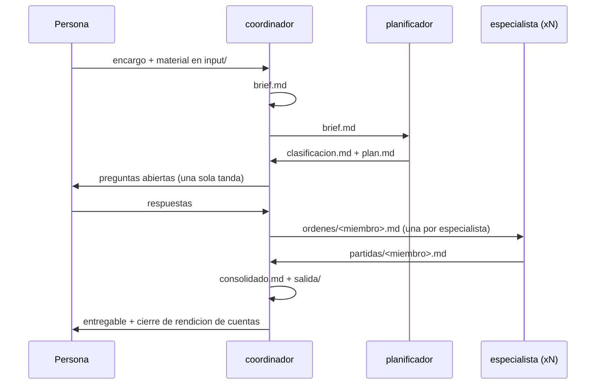

# Arquitectura

Documento técnico del sistema: qué pieza hace qué, con qué contrato se hablan entre ellas, y por
qué está diseñado así y no de otra forma.

**A quién le sirve.** A quien va a modificar el motor: agregar un agente, cambiar el esquema del
registry, escribir los scripts o extender el flujo. Para **usar** el sistema basta el `README.md`;
para **personalizarlo**, `PERSONALIZAR.md`; para operarlo como agente, `CLAUDE.md`.

A diferencia de esos tres, este documento **no tiene espacios para rellenar**: describe el motor,
que es igual en cualquier rubro.

---

## 1. Principios de diseño

Seis decisiones de fondo, de las que se derivan casi todas las demás.

1. **El conocimiento vive en archivos de texto versionados, no en prompts.** Un criterio escrito en
   un archivo se puede revisar, discutir, culpar y corregir. Un criterio metido en un prompt se
   pierde en cuanto cambia la conversación.
2. **La identidad se separa del motor.** `CLAUDE.md`, `staff/`, `packs/`, `refs/` y `plantillas/`
   son la identidad del negocio. Los agentes, las skills y los scripts son el motor. Cambiar de
   rubro significa reescribir la identidad y no tocar el motor.
3. **Cada rol ve solo lo que necesita.** El aislamiento no es seguridad: es calidad. Un
   especialista que ve el encargo completo se contagia del encuadre de quien lo redactó, y las
   contradicciones entre especialidades dejan de aparecer.
4. **Todo dato declara su procedencia.** Cuatro orígenes posibles: `refs/`, un `costos.md`, un
   adjunto del cliente, o supuesto explícito. No existe una quinta categoría, y no existe el número
   sin origen.
5. **Toda corrida deja expediente.** El valor del sistema no es la respuesta: es poder reconstruir
   cómo se llegó a ella y en qué punto se torció.
6. **El sistema aprende por promoción, no por acumulación.** Las correcciones entran a `feedback/`,
   y cuando se repiten se **promueven** al archivo de criterio que corresponde. Un `feedback/` que
   solo crece es un sistema que no aprende.

---

## 2. Modelo de datos

### Fuente de verdad y derivados

| Categoría | Directorios | Naturaleza |
|---|---|---|
| **Identidad** | `CLAUDE.md`, `staff/`, `packs/`, `refs/`, `plantillas/` | Fuente de verdad. Se edita a mano, se versiona, cambia lento. |
| **Entrada** | `input/`, `runs/<corrida>/adjuntos/` | Material externo. Inmutable: se archiva, no se edita. |
| **Derivado** | `runs/<corrida>/` (salvo adjuntos), `propuestas/` | Producto de una corrida. Reproducible desde identidad + entrada. |
| **Aprendizaje** | `feedback/` | Tránsito. Su destino es desaparecer dentro de la identidad. |

Regla que se deriva de la tabla: **si borras todo lo derivado, el sistema sigue siendo el mismo.**
Si borras la identidad, no queda nada.

### Las cuatro piezas de la identidad

| Pieza | Unidad | Responde a la pregunta |
|---|---|---|
| `staff/<id>/` | Un especialista | ¿Quién ejecuta, con qué método y a qué costo? |
| `packs/<id>/` | Un servicio vendible | ¿Qué vende la oficina y con qué alcance? |
| `refs/` | Una norma o estándar | ¿Qué rige, independiente de quién trabaje? |
| `plantillas/` | Un guion de documento | ¿Qué forma tiene lo que sale de la casa? |

`packs/registry.yaml` es el único índice: conecta señales de un encargo con packs y con staff.

### Identificador de corrida

`AAAA-MM-DD-<slug-del-encargo>`, minúsculas y guiones. Es la llave de todo el expediente y el
nombre de la carpeta en `runs/`. Cuando una corrida tiene etapa comercial previa, `propuestas/`
usa el mismo identificador para poder cruzarlas.

---

## 3. Los tres agentes y sus contratos



### Contrato de cada rol

| Rol | Lee | Escribe | Herramientas | Nunca |
|---|---|---|---|---|
| **coordinador** | `CLAUDE.md`, `feedback/GLOBAL.md`, `registry.yaml`, adjuntos, partidas | `brief.md`, `ordenes/`, `consolidado.md`, `salida/`, `adjuntos/` | Read, Write, Edit, Glob, Grep, Bash, Task | Clasifica por su cuenta; escribe partidas |
| **planificador** | `brief.md`, `registry.yaml`, `packs/*/detalles.md`, `rol.md` de candidatos, `refs/INDEX.md`, `feedback/` | `clasificacion.md`, `plan.md` | Read, Write, Glob, Grep | Ejecuta; cotiza; lee metodologías |
| **especialista** | Su `ordenes/<miembro>.md`, su `rol.md`/`metodologia.md`/`costos.md`, sus referencias, su `feedback/staff/<id>.md` | `partidas/<miembro>.md`, y nada más | Read, Write, Glob, Grep | Lee el brief, el plan u otras partidas |

Las restricciones no son solo prosa: **el conjunto de herramientas las hace cumplir.** Sin `Bash`
ni `Edit`, planificador y especialista no pueden ejecutar procesos ni modificar archivos
existentes. Solo el coordinador tiene `Task`, así que la delegación es de una sola dirección y no
hay cadenas de agentes delegando en agentes.

### Matriz de escritura

| Ruta | Quién escribe |
|---|---|
| `input/` | La persona. El sistema solo lee. |
| `runs/<corrida>/adjuntos/<lote>/` | coordinador, una vez, sin modificar el original |
| `runs/<corrida>/adjuntos/_texto/` | `ingesta.py` |
| `runs/<corrida>/brief.md` | coordinador |
| `runs/<corrida>/clasificacion.md`, `plan.md` | planificador |
| `runs/<corrida>/ordenes/<miembro>.md` | coordinador |
| `runs/<corrida>/partidas/<miembro>.md` | el especialista dueño de ese archivo |
| `runs/<corrida>/consolidado.md`, `salida/` | coordinador |
| `propuestas/<id>/` | coordinador (flujo `proponer`) |
| `staff/`, `packs/`, `refs/`, `plantillas/`, `CLAUDE.md` | Solo la persona. Un agente puede **proponer** cambios; no los aplica solo. |
| `feedback/_bruto/` | La persona |
| `feedback/GLOBAL.md`, `feedback/staff/`, `feedback/packs/` | coordinador, al cerrar una corrida, con lo que la persona confirme |

**Ningún archivo tiene dos autores.** Es lo que permite ejecutar especialistas en paralelo sin
coordinación adicional: cada uno escribe su propio archivo y nadie pisa a nadie.

---

## 4. Los tres flujos (skills)

Los tres comparten el tramo de entendimiento y se separan en el destino.

| Skill | Cuándo | Produce | Termina en |
|---|---|---|---|
| `proponer` | Todavía hay que cotizar o convencer | Propuesta comercial | `propuestas/<id>/propuesta.pdf` |
| `ejecutar` | El trabajo está aprobado | Corrida completa | `runs/<id>/consolidado.md` |
| `entregar` | La ejecución está lista | Entregable con forma | `runs/<id>/salida/` |

### `proponer`

1. Ingesta y `brief.md` en `propuestas/<id>/`.
2. Clasificación: pack, staff, entradas mínimas faltantes.
3. Cuantificación **gruesa**: los especialistas entregan magnitud y rango, no partidas cerradas.
4. Armado del documento con `plantillas/estructura-propuesta.md`.
5. Cierre: supuestos que sostienen el precio, y qué lo cambiaría.

La diferencia con `ejecutar` no es el rigor: es el nivel de detalle exigible. Una propuesta se
construye con la información que hay antes de tener acceso completo.

### `ejecutar`

El flujo completo del diagrama de la sección 3. Es el camino por defecto.

### `entregar`

1. Lee `consolidado.md` y el guion que corresponda.
2. Verifica que todas las secciones del guion tengan contenido o justificación de ausencia.
3. Construye el documento y lo deja en `salida/`.
4. Cierre con las tres líneas de rendición de cuentas.

Está separado de `ejecutar` porque **la forma se rehace más veces que el fondo**: cambiar el
formato de un entregable no debería obligar a repetir el trabajo técnico.

---

## 5. Scripts

Trabajo determinista, fuera del criterio del agente. Un script existe cuando el resultado debe ser
idéntico cada vez que se ejecuta.

### `.claude/scripts/ingesta.py`

**Contrato.** Entrada: una ruta de corrida y un lote en `runs/<corrida>/adjuntos/<lote>/`.
Salida: un archivo de texto por adjunto en `runs/<corrida>/adjuntos/_texto/`, más un índice.

Requisitos:

- No modifica el original. Nunca.
- Un archivo de salida por archivo de entrada, con el mismo nombre base y extensión `.md` o `.txt`.
- Cada salida abre con una cabecera de procedencia: archivo original, fecha del lote, herramienta y
  versión usada para la conversión.
- Lo que no se puede convertir se registra como no convertible, con la razón. **No falla en
  silencio**: un adjunto ilegible que nadie reporta es la forma más común de perder un dato del
  cliente.
- Determinista: la misma entrada produce la misma salida.

### `.claude/scripts/resolver.py`

**Contrato.** Entrada: un conjunto de señales (texto del encargo, o lista explícita).
Salida: los packs que aplican, los especialistas que se activan y las referencias obligatorias,
cada uno con la señal que lo justificó.

Requisitos:

- Lee `packs/registry.yaml` y nada más. No infiere lo que no está declarado.
- Devuelve **evidencia junto a la conclusión**: qué señal coincidió y con qué pack.
- Empate entre packs: no elige. Devuelve los candidatos ordenados y deja la decisión al
  planificador, que tiene el brief a la vista.
- Cero coincidencias es un resultado válido, no un error.

El resolver existe para que la clasificación sea **reproducible**: dos corridas con el mismo
encargo activan las mismas piezas.

---

## 6. Esquema de `packs/registry.yaml`

```yaml
packs:
  - id: <id-del-servicio>          # obligatorio. Debe existir packs/<id>/detalles.md
    nombre: "<nombre comercial>"   # obligatorio. Lo que ve el cliente
    señales:                        # obligatorio. Lista de strings, en las palabras del cliente
      - "<palabra o frase>"
    staff:                          # obligatorio. Ids que deben existir como staff/<id>/
      - <id-del-especialista>
    refs_obligatorias:              # obligatorio (puede ir vacío). Rutas dentro de refs/
      - <archivo>
    entregable: <ruta>              # obligatorio. Guion de plantillas/ que aplica
    prioridad: <numero>             # opcional. Desempata cuando dos packs coinciden igual
    excluye: [<id-de-pack>]         # opcional. Packs que no pueden activarse junto a este
```

**Reglas de resolución**, en orden:

1. Un pack es candidato si al menos una de sus señales coincide.
2. Entre candidatos, ordena por cantidad de señales coincidentes.
3. Si hay empate, usa `prioridad` (menor número gana).
4. Si el empate persiste, **devuelve los candidatos sin elegir**. Un sistema que adivina en un
   empate esconde justo la ambigüedad que hay que resolver con la persona.
5. `excluye` se aplica al final: si dos packs incompatibles quedaron activos, es un conflicto que se
   reporta.

**Validaciones que debe hacer el resolver:** todo `id` de pack tiene carpeta; todo `id` de staff
tiene carpeta con sus tres archivos; toda ruta de `refs_obligatorias` y de `entregable` existe. Una
referencia rota es un error de configuración, y se reporta como tal antes de correr nada.

---

## 7. Formato de los archivos de corrida

Cada archivo de una corrida es un contrato entre dos roles. Las secciones no son sugerencias: si
falta una, el siguiente rol no puede trabajar.

| Archivo | Secciones mínimas | Lo consume |
|---|---|---|
| `brief.md` | Cliente y contacto · Objetivo · Alcance declarado · Plazo · Restricciones · Lo afirmado vs. lo demostrado · Pendiente de confirmar | planificador |
| `clasificacion.md` | Pack que aplica + evidencia · Packs descartados + razón · Staff activado + por qué · Entradas mínimas (tabla ¿está?) · Referencias obligatorias | coordinador |
| `plan.md` | Unidades de trabajo (tabla) · Secuencia y dependencias · Riesgos con plan B · Criterio de cierre · Preguntas abiertas priorizadas | coordinador |
| `ordenes/<miembro>.md` | Contexto mínimo · Entregable esperado · Entradas que se le entregan · Límites y qué no debe hacer · Plazo | especialista |
| `partidas/<miembro>.md` | Alcance de la partida · Desarrollo · Cuantificación (con columna Origen) · Supuestos · Alertas · Fuera de mi competencia | coordinador |
| `consolidado.md` | Integración por unidad de trabajo · Contradicciones resueltas y con qué criterio · Totales · Supuestos abiertos · Escalamientos | flujo `entregar` |

La columna **Origen** de las cuantificaciones es el corazón de la auditoría: `costos.md`, `refs/`,
adjunto del cliente, o supuesto. Sin ella, el consolidado es una suma de números sin trazabilidad.

---

## 8. Estado, concurrencia y reproducibilidad

- **La corrida es la unidad de aislamiento.** Todo el estado de un encargo vive dentro de
  `runs/<id>/`. No hay estado global mutable.
- **Paralelismo seguro por diseño:** varios especialistas corren a la vez porque cada uno escribe un
  archivo distinto. El plan declara las dependencias que impiden ese paralelismo.
- **Reproducibilidad:** identidad + adjuntos + brief deberían reconstruir la corrida. Lo que rompe
  esa propiedad son las decisiones tomadas en conversación y no escritas; por eso el cierre de
  rendición de cuentas es obligatorio.
- **Sin migraciones.** Si un `costos.md` cambia, las corridas anteriores no se recalculan: quedan
  como testimonio de lo que se cotizó con la información de su momento.

---

## 9. Ciclo de aprendizaje

```
corrida → error detectado → feedback/_bruto/ → destilado a feedback/{GLOBAL,staff,packs}
       → si se repite → promovido a rol.md / metodologia.md / costos.md / CLAUDE.md
       → marcado como incorporado
```

Dos reglas que sostienen el ciclo:

1. **El agente propone la promoción; la persona la aprueba.** Un sistema que reescribe su propio
   criterio sin supervisión deriva sin que nadie note cuándo empezó.
2. **Lo incorporado se marca**, con fecha y destino. Es lo que permite distinguir el feedback vivo
   del histórico.

---

## 10. Decisiones de diseño y alternativas descartadas

| Decisión | Alternativa descartada | Por qué |
|---|---|---|
| Archivos de texto en git | Base de datos o app con formularios | El criterio profesional se escribe en prosa, se revisa en diff y se discute en un PR. Una base de datos obliga a decidir el esquema antes de entender el negocio. |
| Especialista aislado de la corrida | Un solo agente con todo el contexto | Con contexto completo, el agente concilia contradicciones antes de que se vean. El aislamiento las hace emerger, que es el trabajo que de verdad importa al integrar. |
| Clasificación delegada al planificador | Coordinador clasifica y ejecuta | Dos lecturas independientes del mismo encargo detectan lo que una sola normaliza. |
| `costos.md` junto a cada especialista | Tarifario central único | El costo es parte del oficio: el que sabe cómo se hace el trabajo es el que sabe cuánto rinde. Un tarifario central envejece separado de la metodología que lo justifica. |
| Registry como archivo declarativo | Clasificación por criterio del agente en el prompt | Un archivo se versiona, se prueba contra encargos pasados y se corrige. El criterio en el prompt no se puede auditar. |
| Empates sin resolver automáticamente | Elegir el más probable | El empate es información: significa que el catálogo de servicios se solapa, o que el encargo es mixto. Resolverlo en silencio pierde el dato. |
| `feedback/` como tránsito | Bitácora permanente | Una bitácora se llena y nadie la lee. La promoción obliga a decidir si el aprendizaje cambia el criterio o no. |
| Scripts solo para lo determinista | Automatizar también la clasificación | Lo que requiere criterio se degrada al convertirlo en reglas rígidas; lo que es mecánico se degrada al dejarlo al criterio. |

---

## 11. Límites conocidos

Escritos a propósito, para que nadie los descubra en producción:

- **Una corrida a la vez por encargo.** No hay bloqueo que impida dos corridas escribiendo la misma
  carpeta; la convención del identificador es lo único que lo evita.
- **Sin versionado de tarifas.** `costos.md` refleja el presente. Recuperar la tarifa vigente en una
  fecha pasada requiere ir al historial de git.
- **Una sola moneda y un solo idioma por repositorio**, definidos en `CLAUDE.md`. Operar en dos
  mercados pide dos repositorios o un cambio en el bloque de contexto local.
- **La calidad depende de la identidad escrita.** Con `staff/` pobre, el sistema produce trabajo
  pobre con excelente trazabilidad.
- **Las plantillas `.potx` no se generan solas.** El sistema respeta el guion en markdown; la
  construcción del documento final depende de las herramientas disponibles.

---

## 12. Cómo extender el sistema

**Agregar un especialista:** copiar `staff/_PLANTILLA/`, completar los tres archivos, registrar su
`id` en el `staff` de los packs donde participe.

**Agregar un servicio:** copiar `packs/_PLANTILLA/`, escribir `detalles.md`, agregar la entrada en
`registry.yaml` con sus señales, y probar la clasificación contra tres encargos pasados.

**Agregar un agente:** definir su contrato antes de escribir su prompt — qué lee, qué escribe, qué
no puede tocar — y darle el conjunto mínimo de herramientas que ese contrato exige. Si necesita
`Bash` o `Task`, pregúntate primero si el trabajo no le corresponde al coordinador.

**Agregar una skill:** solo si aparece un destino nuevo. `proponer`, `ejecutar` y `entregar` cubren
cotizar, hacer y dar forma; una cuarta skill que solo cambie el detalle de una de esas tres es una
variante, no un flujo.

**Agregar un script:** solo si el resultado debe ser idéntico en cada ejecución. Si requiere
criterio, es trabajo de un agente.

## 13. Estado de implementación

| Pieza | Estado |
|---|---|
| Estructura, `README.md`, `CLAUDE.md`, `PERSONALIZAR.md` | Escritos |
| Agentes (`coordinador`, `planificador`, `especialista`) | Escritos |
| Moldes de `staff/` (ejecución, diagnóstico, transversal) | Escritos |
| Este documento | Escrito |
| Skills (`proponer`, `ejecutar`, `entregar`) | Pendientes |
| Scripts (`ingesta.py`, `resolver.py`) | Pendientes, con contrato definido en la sección 5 |
| `packs/_PLANTILLA`, `staff/_PLANTILLA`, `refs/`, `plantillas/` | Pendientes |
| `.claude/settings.json` (permisos del proyecto) | Pendiente |
| Ejemplos (`construccion`, `agencia-marketing`) | Pendientes |
